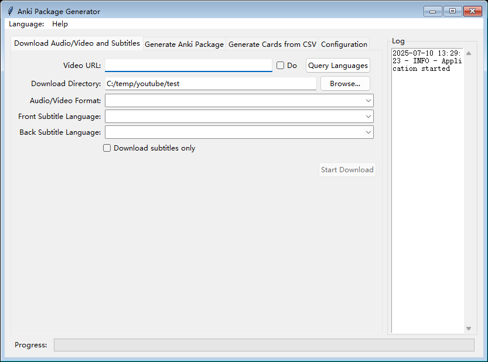
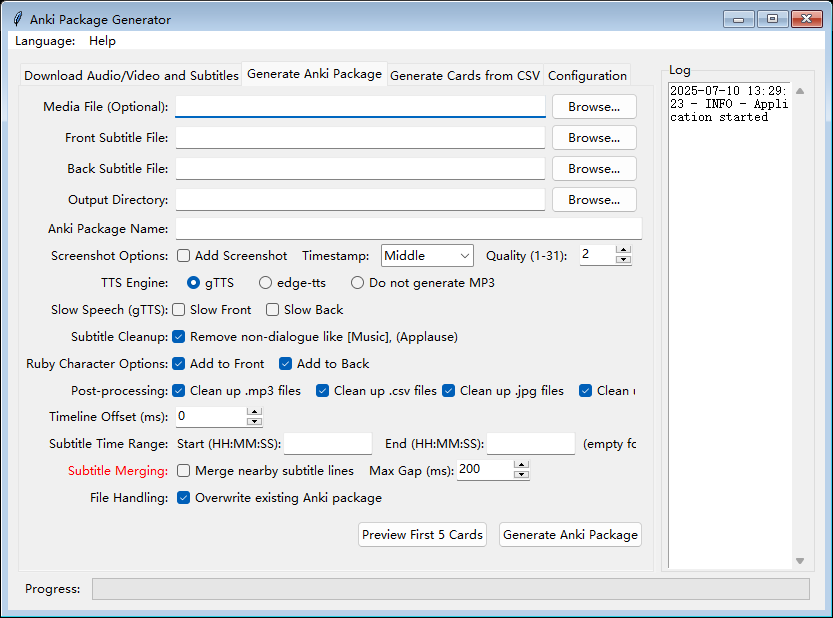

As a programmer, while learning Japanese, I discovered the amazing learning tool called Anki. I've always wanted to import the large amount of data I've accumulated into Anki, but creating cards manually one by one is too troublesome, so I never took action.

Recently, I've been thinking about how AI assistants can better collaborate with software development, so I decided to give it a try. With the help of an AI assistant, I used Python, a language I've never used before, to develop an application that can download YouTube audio/video and subtitles locally, and then use ffmpeg and TTS to generate corresponding Anki packages.

The prototype was developed very quickly, in less than a day. To my surprise, during the interaction with the AI assistant, it gave me a lot of requirements that I then implemented in the program.

However, from an architect's perspective, the code's modularity is not very good, and I probably need to study and understand it more deeply.

The corresponding instructions are below (the multi-language versions were generated and translated by AI, and I have only made minor modifications).

[English](src/help/help_en.md) [简体中文](src/help/help_zh_hans.md) [繁体中文](src/help/help_zh_hant.md) [日本語](src/help/help_ja.md) [한국어](src/help/help_ko.md)  [Tiếng Việt](src/help/help_vi.md)

