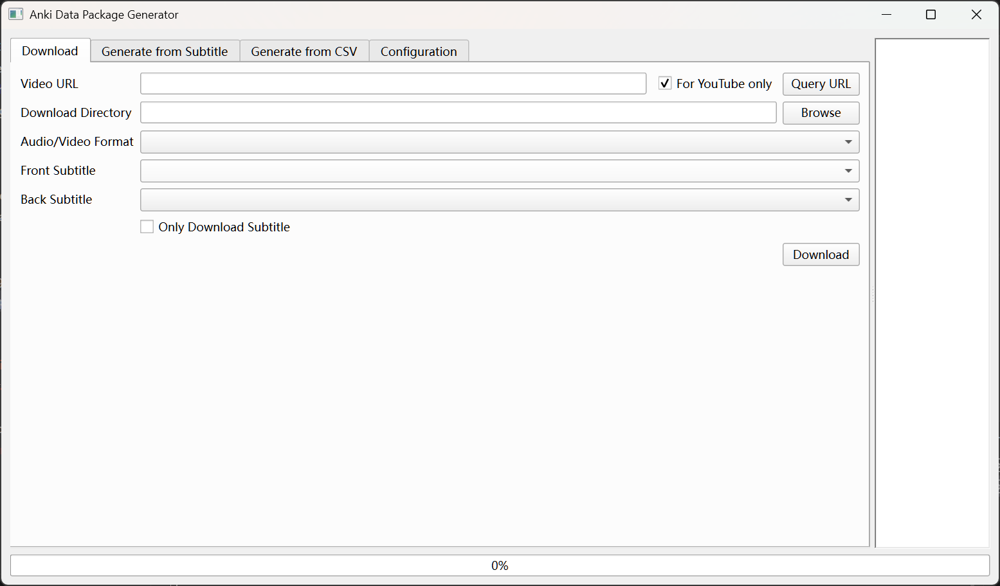
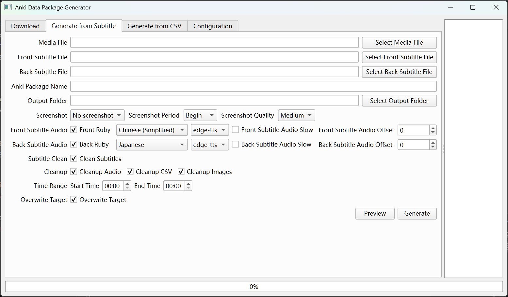
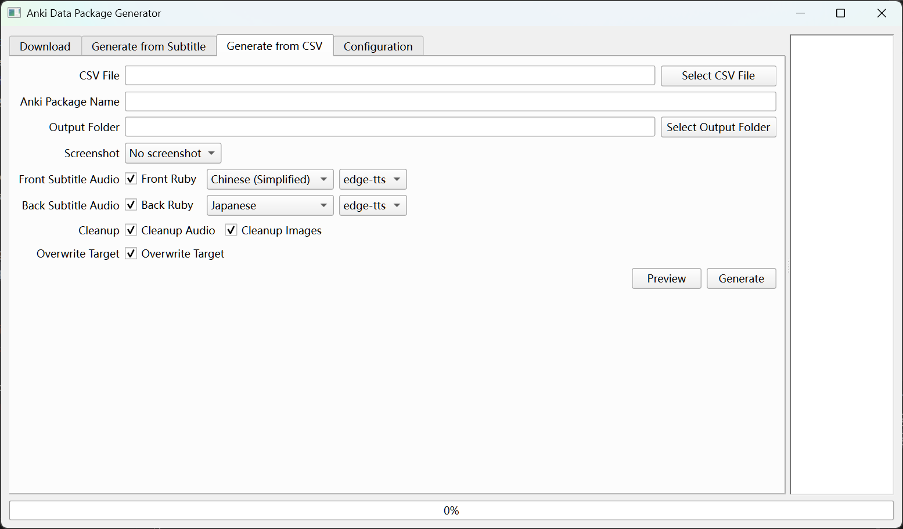
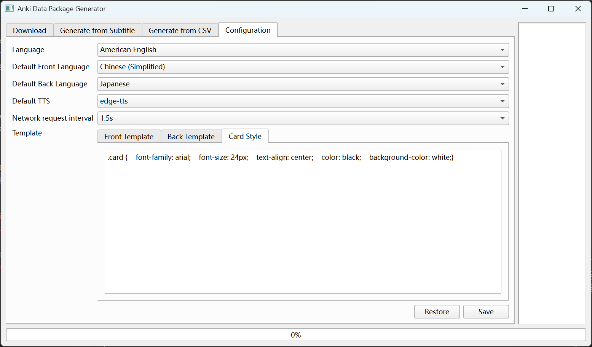

[English](README.md)

作为一名程序员，在学习日语的过程中，认识了Anki这个好用的学习神器。一直想将积累的大量数据导入Anki中，但手工单条制作太麻烦了，于是一直没有行动。
最近思考未来AI助手如何与软件开发进行更好地协作，于是就想试试水。用一门自己从没用过的Python，在AI助手的帮助下开发一款能将youtube音视频和字幕下载到本地，然后使用ffmpeg和tts生成相应的Anki数据包。
原型开发很快，不到一天就完成了。让人惊喜的是，在与AI助手中交互的过程中，AI助手反馈了大量的需求给我，并应用在程序中。
但从一个架构师的角度出发，代码的模块化并不好，估计AI助手还需要更深入的学习和理解。
所以在第一个版本完成后，决定在AI的帮助下，使用Qt重新实现Gui，并将代码模块化。
这次重构后的开发过程：分层后，定义相应的接口协议，然后再划分模块，仅将100行以下的小功能代码交给AI生成，总体会比第一个版本好很多。后续会尝试更多的AI协作实践。
相应的使用说明帮助在下面（多语言版本是由AI生成并翻译的，我仅作了少许修改）。

## 运行方式
前置条件：先安装[FFmpeg官网](https://ffmpeg.org/)（可选项，如果不需要提取原声，则不必安装）

### 方法1：使用预编译的安装包
如果您是普通用户，可以从项目的Release页面下载预编译的安装包（目前暂时只有Windows版本），解压缩后运行AnkiGenerator.exe文件即可。

### 方法2：直接运行（需要Python环境），有编码或者系统经验的用户更推荐此方式（便于升级）
如果您熟悉python，请先安装Python3.0以上版本（推荐`3.10`，不推荐`3.13`，因为`3.13`移除了一个内置库，可能导致运行错误），再将下载后的zip文件解压缩后运行`run.bat`（linux/macos平台则使用run.sh），会在当前目录下创建python的venv环境。并自动运行`app/aquarius/main.py`。

## 帮助
如果需要帮助，直接按F1键即可打开帮助文件。
[English](src/help/help_en.md) [简体中文](src/help/help_zh_hans.md) [繁体中文](src/help/help_zh_hant.md) [日本語](src/help/help_ja.md) [한국어](src/help/help_ko.md)  [Tiếng Việt](src/help/help_vi.md)

